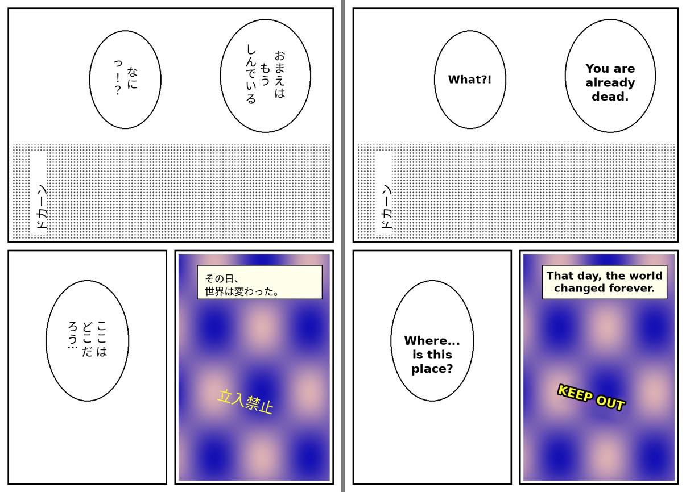
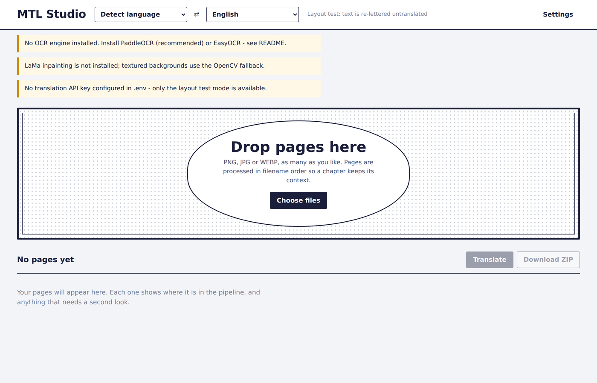
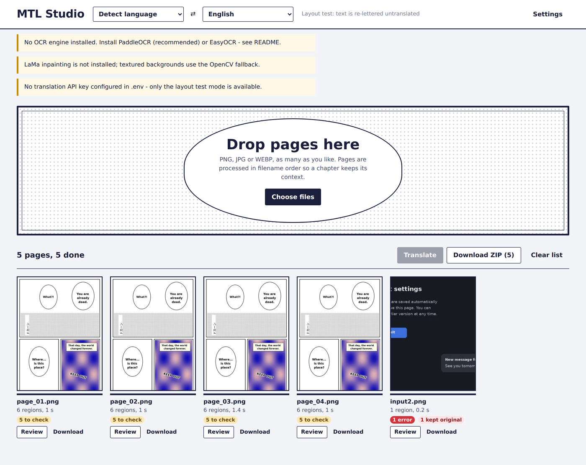
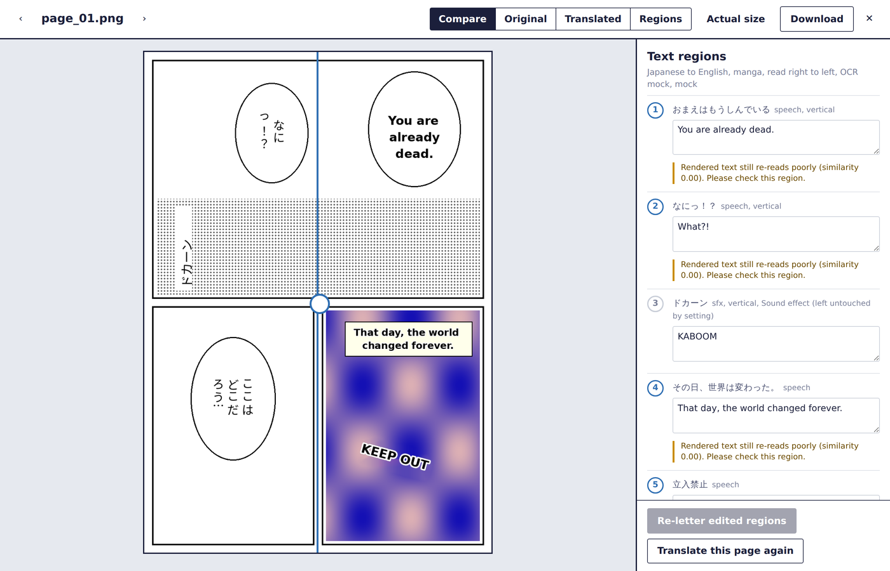
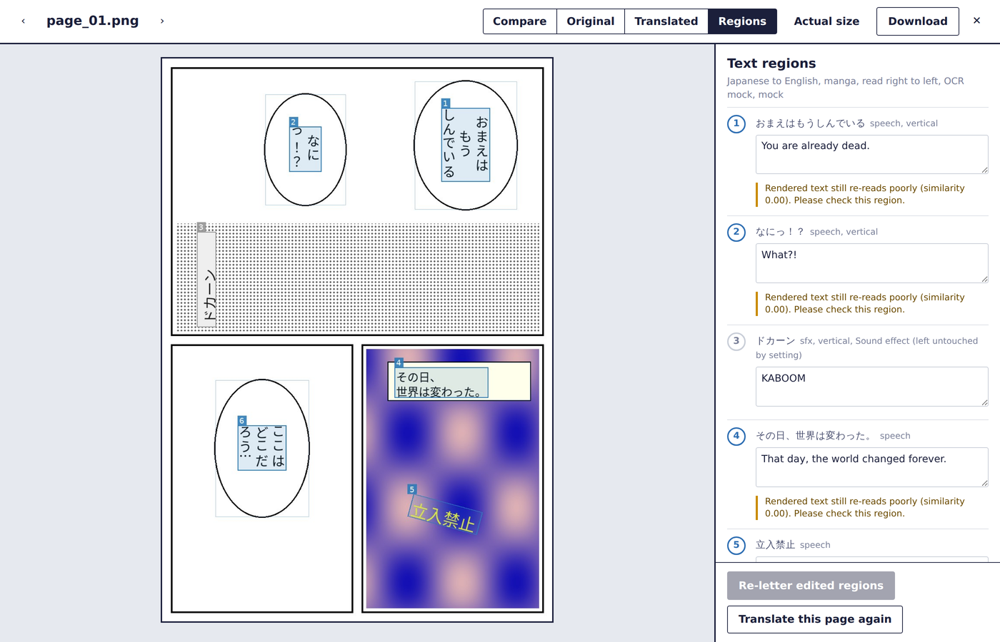
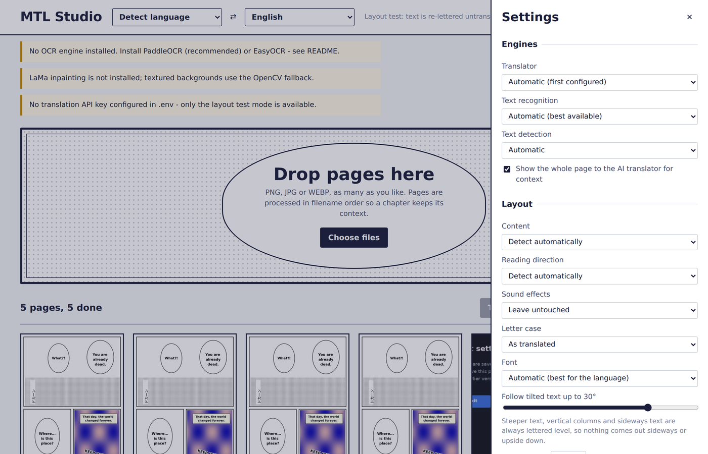

# MTL Studio

MTL Studio translates the text inside images, in bulk, and letters the translation back into the
picture so the page looks as if it had been published in your language. It is built for manga,
manhwa, webtoons and comics, and also handles screenshots, signs and scanned documents.

For every page it finds each line of text, works out its orientation, reads it, groups it into
speech bubbles and captions, translates the whole page in reading order, removes the original
text without damaging the artwork, and letters the translation into the same space. A validation
pass checks every region before the final image is saved, and anything that cannot be lettered
safely is left in the original language and flagged, rather than rendered wrong.

It runs on your own computer in a web browser. It can be completely free: the text recognition
and clean-up always run locally, and translation can use a local AI model through Ollama.

## Demo

All screenshots below come from the built-in offline self-test (`python scripts/selftest.py`),
which runs the whole pipeline on a generated test page using stand-in OCR and translation, so no
models or API keys are needed. Because the stand-in OCR cannot re-read real letters, the review
panel shows "re-reads poorly" notes that you would not normally see.

**Before and after.** Vertical Japanese becomes level English, fitted to each bubble. The caption
box keeps its border, the sign keeps its 15 degree tilt, and the sideways sound effect is left as
drawn (the default for sound effects).



**Add pages.** Drag images in, or paste them. Notices at the top tell you what still needs setting up.



**Batch queue.** Every page shows its stage and progress, with badges for anything worth checking.



**Review.** Drag the slider to compare before and after. Every region's translation can be edited
and re-lettered on its own.



**Regions.** The numbered reading order, right to left for manga, with each detected block outlined.



**Settings.** Engines, layout, quality checks, glossary and translator instructions.



---

**Contents**

0. [Demo](#demo)
1. [Requirements](#1-requirements)
2. [Installation on Windows](#2-installation-on-windows)
3. [Choosing a translator](#3-choosing-a-translator)
4. [Starting and stopping the app](#4-starting-and-stopping-the-app)
5. [Using the app](#5-using-the-app)
6. [Settings](#6-settings)
7. [Configuration file (.env)](#7-configuration-file-env)
8. [How it works](#8-how-it-works)
9. [Troubleshooting](#9-troubleshooting)
10. [Installation on macOS and Linux](#10-installation-on-macos-and-linux)
11. [Project layout and HTTP API](#11-project-layout-and-http-api)
12. [Privacy and content](#12-privacy-and-content)

---

## 1. Requirements

| | Minimum | Recommended |
|---|---|---|
| Operating system | Windows 10/11, macOS, Linux | |
| Python | 64-bit **3.10, 3.11 or 3.12** | 3.11 |
| Memory | 8 GB | 16 GB, especially with a local AI translator |
| Disk space | about 10 GB (packages and models) | |
| Graphics card | not required | NVIDIA GPU makes everything much faster |

**Python 3.13 and newer will not work**, because PaddlePaddle (the main text recognition library)
has no builds for them yet. You can keep a newer Python installed alongside 3.11; the app uses its
own environment.

---

## 2. Installation on Windows

You only do this once. Run the commands in **PowerShell**, one step at a time.

### Step 1. Install Python 3.11

```powershell
winget install Python.Python.3.11
```

Or download the "Windows installer (64-bit)" for Python 3.11 from python.org. Then **close
PowerShell and open a new window**, and check that 3.11 is listed:

```powershell
py -0
```

### Step 2. Create the app's environment

Go to the folder you unzipped (the one that contains `run.py`), then create and activate a
private Python environment for the app:

```powershell
cd C:\path\to\mtl-studio
py -3.11 -m venv .venv
.venv\Scripts\Activate.ps1
python --version
```

The prompt should now start with `(.venv)` and the version should be `3.11.x`.
If activation says "running scripts is disabled on this system", run this and activate again:

```powershell
Set-ExecutionPolicy -Scope Process -ExecutionPolicy Bypass
```

### Step 3. Install the app's packages

```powershell
pip install -r requirements.txt
pip install -r requirements-ocr.txt
pip install --no-deps simple-lama-inpainting
pip install fire
```

The second command is large (several GB, it includes PyTorch). It can sit silently for 10 to 20
minutes after the "Uninstalling..." lines while Windows copies and virus-scans thousands of files.
That is normal; wait for `Successfully installed`.

The LaMa inpainting package is installed separately with `--no-deps` on purpose: it asks for an old
version of Pillow that conflicts with manga-ocr, but works fine with the newer one.

Check that the engines load:

```powershell
python -c "import paddleocr, manga_ocr, simple_lama_inpainting; print('all OCR engines OK')"
```

A warning about `torchvision` is harmless and can be ignored.

### Step 4. Download the fonts

```powershell
python scripts/download_fonts.py
```

### Step 5. Switch Python to UTF-8 (important on non-English Windows)

```powershell
setx PYTHONUTF8 1
```

This prevents errors such as `'cp949' codec can't encode character` on Windows set to Korean,
Japanese or Chinese. It is harmless on English Windows. Open a new PowerShell window afterwards.
(The app also saves its files as UTF-8 itself; this setting covers the libraries it uses.)

### Step 6. Choose a translator and create the settings file

```powershell
copy .env.example .env
notepad .env
```

See [section 3](#3-choosing-a-translator) for what to put in it. If you leave every key empty, the
app still runs in **layout test** mode, which re-letters the original text untranslated. That is
useful for checking detection and clean-up without a translator.

### Step 7. Start the app

Double-click **`Start MTL Studio.bat`** in the app folder. See [section 4](#4-starting-and-stopping-the-app).

---

## 3. Choosing a translator

Text recognition and clean-up always run on your computer. Only translation can involve an
outside service.

| Translator | Cost | Quality | Sees the page image | Notes |
|---|---|---|---|---|
| **Ollama** (local AI) | Free | Good | Yes, with a vision model | Runs on your PC, no account or limits. Slow without a GPU. |
| **DeepL API Free** | Free up to 500,000 characters a month | Very good for plain text | No | Fast. Cannot use page context or fix OCR mistakes. Not every language (no Filipino). |
| **Claude** (Anthropic) | Paid, a few cents per page | Best | Yes | Uses the page to work out speakers, pronouns and names, and fixes OCR slips. |
| OpenAI | Paid | Very good | Yes | Any OpenAI-compatible service works. |
| Google Translate | Paid | Good for plain text | No | |

The app uses the first translator that has a key, in this order: Claude, OpenAI or a local
server, DeepL, Google. **Leave the keys empty for any service you don't want used.** You can also
pick one explicitly in **Settings > Translator**. Always restart the app after editing `.env`.

### Free: Ollama (local AI)

1. Install Ollama from **ollama.com** (or `winget install Ollama.Ollama`), then open a **new**
   PowerShell window and download a vision model (about 6 GB, one time only):

   ```powershell
   ollama pull qwen2.5vl:7b
   ```

2. In `.env`:

   ```
   ANTHROPIC_API_KEY=
   OPENAI_API_KEY=
   OPENAI_MODEL=qwen2.5vl:7b
   OPENAI_BASE_URL=http://localhost:11434/v1
   OPENAI_SUPPORTS_VISION=true
   LLM_TIMEOUT_S=600
   ```

   `LLM_TIMEOUT_S=600` gives the model up to 10 minutes per page; local models can be slow on a CPU.

3. Keep Ollama running (the llama icon in the system tray) while you translate. The launcher
   starts it for you if it isn't running.

If it's too slow, try a smaller model (`ollama pull gemma3:4b`, then `OPENAI_MODEL=gemma3:4b`), or a
text-only model with `OPENAI_SUPPORTS_VISION=false`, which is faster but loses the page context.
Local models are noticeably weaker than Claude on natural dialogue, so expect to correct some
lines in the review panel.

### Free: DeepL API Free

Sign up for the free API plan at **deepl.com/pro-api**. The free key ends in `:fx`; the app uses
the free endpoint automatically.

```
DEEPL_API_KEY=your-key:fx
```

### Paid: Claude

Create a key at **console.anthropic.com**. The API is billed separately from a Claude.ai
subscription, so you need to add credit in the Console. Setting a monthly spend limit on its
Billing page is a good way to avoid surprises. The app sends one request per page, and your exact
usage is shown in the Console.

```
ANTHROPIC_API_KEY=sk-ant-...
ANTHROPIC_MODEL=claude-sonnet-5
```

To spend less, use `ANTHROPIC_MODEL=claude-haiku-4-5-20251001` (cheaper and faster, less accurate),
or turn off **Show the whole page to the AI translator** in Settings.

### Paid: OpenAI and other services

```
OPENAI_API_KEY=sk-...
OPENAI_MODEL=gpt-5
OPENAI_BASE_URL=https://api.openai.com/v1
```

`OPENAI_BASE_URL` can point at any OpenAI-compatible server (Ollama, LM Studio, vLLM, OpenRouter).
Google: set `GOOGLE_TRANSLATE_API_KEY`.

---

## 4. Starting and stopping the app

**The easy way:** double-click **`Start MTL Studio.bat`** (it must stay in the app folder, next to
`run.py`). It starts Ollama if needed, starts the app with the right Python, and opens your
browser at **http://127.0.0.1:8000** when it's ready. For a desktop icon, right-click it >
Show more options > Send to > Desktop (create shortcut). If Windows says "Windows protected your
PC", click More info > Run anyway.

**By hand:**

```powershell
cd C:\path\to\mtl-studio
.venv\Scripts\Activate.ps1
python run.py
```

Then open **http://127.0.0.1:8000**. Keep the black window open while you use the app.

**To stop it,** close the window, or press **Ctrl+C** in it (answer **Y** to "Terminate batch job?").

**The first page is slow.** The first time each engine runs it downloads its model files
(1 to 2 GB in total), so the first page can spend several minutes on "Finding text" or
"Reading text". After that, pages are much faster.

The window prints a line for every request. Lines like `GET /favicon.ico 404 Not Found` are
normal. Only lines with `ERROR` or a Python traceback indicate a problem.

---

## 5. Using the app

1. **Pick the languages** in the top bar. "Detect language" works for Japanese, Korean, Chinese,
   Thai, Russian and English-alphabet languages.
2. **Add pages**: drag images onto the panel, click **Choose files**, or paste an image with Ctrl+V. PNG, JPG, JPEG and WEBP are
   supported, as many as you like. Pages are processed in filename order (`p2` before `p10`), so a
   chapter keeps its context from page to page. Name your files in reading order.
3. Click **Translate**. Each card shows its stage ("Finding text", "Translating", "Lettering"...)
   and progress. Try a single page first, especially the first time.
4. **Badges** on each card: red for errors, yellow for things worth checking, and "kept original"
   for regions the app deliberately left untranslated.
5. **Review** opens the page:
   * drag the slider to compare before and after, or switch to Original, Translated or Regions
     (numbered reading order; blue = lettered, red = kept original, grey = skipped);
   * the right-hand panel lists every region with its source text, translation and any issues.
6. **Fix a line:** edit its translation in the panel, then click **Re-letter edited regions**.
   Only the lettering is redone; the cleaned background is reused, so it's quick. This is also
   how you fix regions that were kept original because the translation didn't fit: shorten it
   and re-letter.
7. **Download** a single page from its card or the viewer, or everything with **Download ZIP**.
   Output keeps the original resolution.
8. **Retry** a failed page from its card (it shows the reason), or all of them with Retry failed.
   **Translate this page again** in the viewer redoes a page with the current settings.
9. **Clear list** removes the pages from the app.

Finished pages survive an app restart. Pages that were still processing when the app stopped are
marked as interrupted and can be retried.

---

## 6. Settings

Open **Settings** in the top-right corner. Settings are remembered in your browser and apply to new
pages and retries.

| Setting | Default | What it does |
|---|---|---|
| **Translator** | Automatic | Which translator to use. Automatic picks the first one configured. |
| **Text recognition** | Automatic | manga-ocr for Japanese manga, otherwise PaddleOCR, then EasyOCR. |
| **Text detection** | Automatic | PaddleOCR, or EasyOCR as a fallback. |
| **Show the whole page to the AI translator** | On | Sends the page image with numbered regions, so the AI can see speakers and fix OCR slips. Turn off to save cost or time. |
| **Content** | Detect automatically | Manga, comic, webtoon/manhwa, screenshot/UI or scan/document. Affects font style and reading order. |
| **Reading direction** | Detect automatically | Right to left (manga) or left to right. |
| **Sound effects** | Leave untouched | Leave stylised sound effects as drawn, or translate them. |
| **Letter case** | As translated | Or all capitals, the traditional comic style. |
| **Font** | Automatic | Best installed font for the target language. |
| **Follow tilted text up to** | 30° | Lettering may follow a tilted sign up to this angle (maximum 40°). Steeper text, vertical columns and sideways text are always lettered level, so nothing comes out sideways or upside down. |
| **Smallest font** | 10 px | Never letter smaller than this (also never below 45% of the original size). |
| **When a translation will not fit** | Keep the original text and flag it | Or letter it smaller and flag it. |
| **Re-read lettered text** | On | Reads the finished lettering back with OCR to confirm it's legible and upright, and re-letters it with more contrast if not. |
| **Scan cleaned areas for leftover text** | On | Looks for traces of the original text after removal and cleans them again. |
| **Straighten sideways pages** | On | Rotates pages that were scanned or photographed sideways or upside down. |
| **File format** | PNG (lossless) | Or the same format as the original (JPEG at quality 95, lossless WEBP). |
| **Glossary** | empty | One term per line, `source = target`, e.g. `先輩 = senpai`. AI translators always follow it. |
| **Instructions for the AI translator** | empty | e.g. "Keep honorifics", "Casual tone", "The narrator is female". |

---

## 7. Configuration file (.env)

All keys and model settings live in `.env` in the app folder (copy it from `.env.example`). This is
the only place keys go; `backend/app/config.py` is the only code that reads them. Restart the app
after changing it.

| Variable | Default | Meaning |
|---|---|---|
| `ANTHROPIC_API_KEY` | empty | Claude key. Leave empty to never use Claude. |
| `ANTHROPIC_MODEL` | `claude-sonnet-5` | Claude model. |
| `OPENAI_API_KEY` | empty | OpenAI key. Not needed for Ollama. |
| `OPENAI_MODEL` | `gpt-5` | Model name, e.g. `qwen2.5vl:7b` for Ollama. |
| `OPENAI_BASE_URL` | `https://api.openai.com/v1` | `http://localhost:11434/v1` for Ollama. |
| `OPENAI_SUPPORTS_VISION` | `true` | Set `false` for text-only models. |
| `DEEPL_API_KEY` | empty | DeepL key (free keys end in `:fx`). |
| `GOOGLE_TRANSLATE_API_KEY` | empty | Google Cloud Translation key. |
| `LLM_TIMEOUT_S` | `180` | Seconds to wait for a translation. Use `600` for local models. |
| `DEVICE` | `auto` | `auto`, `cpu` or `cuda`. |
| `ENABLE_LAMA` | `true` | Use LaMa inpainting when installed. |
| `MAX_UPLOAD_MB` | `60` | Largest accepted image. |
| `DATA_DIR` | `./data` | Where uploads, results and review data are stored. |
| `FONT_DIR` | `./fonts` | Extra fonts (`.ttf`, `.otf`, `.ttc`). |
| `PADDLE_*_MODEL` | PP-OCRv5 models | Override PaddleOCR model names if a language model fails to load. |

To use your own font, put the file in `fonts/` and choose it in Settings > Font.

---

## 8. How it works

Every image goes through the same pipeline:

**Image → preprocessing → text detection → orientation detection → OCR → reading-order analysis
→ translation → text removal/inpainting → typography/layout reconstruction → quality validation
→ final image**

**Preprocessing.** Phone-photo EXIF rotation is applied first (the most common cause of sideways
results elsewhere), transparency and colour profiles are kept.

**Detection.** Line by line, never the whole image as one block. Small images are upscaled; very
tall webtoon strips and very wide images are processed in overlapping tiles so text isn't shrunk
away.

**Orientation, before OCR.** Each line's tilt is measured, and the app decides whether it's a
vertical CJK column, a horizontal line or a rotated line. Ambiguous cases, including upside-down
text, are settled by letting the OCR read both possibilities and keeping the more confident one.
Sideways or upside-down pages are detected and straightened.

**OCR.** Each line is cut out upright along its own angle and read individually. Detections
without letters, or read with very low confidence, are treated as artwork and left alone.

**Regions and reading order.** Lines are grouped into regions only when their direction, tilt,
size and stroke weight agree, and never across a speech-bubble outline, so neighbouring bubbles
and a bold heading and its body text stay separate. Panels are found from the gutters between them,
and regions are ordered panel by panel, right to left for manga.

**Translation.** AI translators get the whole page at once: every region in reading order, the page
image with numbered outlines, your glossary and instructions, and the previous pages of the batch.
They correct OCR slips, mark non-text detections and sound effects, and must return exactly one
translation per region. Missing or untranslated regions are retried.

**Text removal.** Only the glyph pixels are removed, never whole boxes. Flat speech bubbles and
labels get an exact background fill, gradients use OpenCV, and screentone, textures and artwork use
LaMa. Bubble outlines and panel borders are protected, and cleaned areas are re-scanned for
leftover traces.

**Lettering.** Text is fitted to the real shape of the bubble (each line gets the width available
at its height, so text follows oval balloons), with balanced line breaks, CJK line-breaking rules,
and hyphenation only as a last resort between letters. Font size is based on the measured size of
the original text, so headings stay larger than body text, bubble text stays consistent across
the page, and left-aligned text keeps its margin. On flat backgrounds, text may extend into empty
space rather than shrink. Fonts are checked for missing characters.

### Orientation and layout safeguards

Translated text **cannot** come out sideways, upside down or mirrored. It is always laid out as
upright horizontal lines, may follow a tilt of at most ±40° (default ±30°), steeper originals are
lettered level, and the only transform used is a pure rotation. This is checked again before the
final image is made.

| Check | What happens |
|---|---|
| Sideways, upside-down, mirrored | Angle limits and the rotation are verified; re-reading the lettering (upright vs. rotated) forces a level re-render if needed. |
| Wrong reading order | Order rebuilt from panels; the translator must return every region exactly once. |
| Overlapping translated text | The lettering of every pair of regions is compared; both are shrunk and re-lettered. |
| Text outside its region, clipped text | Lettering is compared with the allowed area; the font is reduced until it fits. |
| Excessive shrinking | Minimum size in pixels and relative to the original. Tries a tighter bubble margin or nearby empty background first, then keeps the original and flags it. |
| Untranslated or missing text | Source-script characters or empty output trigger a retry; if still wrong, the original is kept and flagged. |
| Duplicated text | The same translation for different source text is flagged. |
| Accidentally translated artwork | Non-letter detections, low-confidence reads and regions the translator marks as not text are left untouched. |
| Leftover original text | Cleaned areas are re-scanned and cleaned again. |
| Legibility | Colour contrast is checked; lettering that re-reads poorly is redone with higher contrast. |

When a region cannot be lettered safely, its original pixels are restored exactly and the page shows
a "kept original" badge. Shorten the translation in the viewer and re-letter it.

---

## 9. Troubleshooting

**Installation**

| Problem | Fix |
|---|---|
| `python` is not recognized | Try `py` instead, or reinstall Python with "Add Python to PATH" ticked. |
| `py -3.11`: "No suitable Python runtime found" | Python 3.11 isn't installed yet (step 1). Install it, then open a new PowerShell window. |
| `Activate.ps1 ... could not be loaded` or "running scripts is disabled" | The environment wasn't created (check step 2), or run `Set-ExecutionPolicy -Scope Process -ExecutionPolicy Bypass` and activate again. |
| `No matching distribution found for paddlepaddle` | Your Python is 3.13+ or 32-bit. Use 64-bit Python 3.11 (step 1), delete `.venv` and recreate it. |
| `ResolutionImpossible` mentioning `pillow<10.0.0` and `simple-lama-inpainting` | Install LaMa separately: `pip install --no-deps simple-lama-inpainting` then `pip install fire`. |
| pip seems stuck after "Uninstalling numpy..." | It's copying PyTorch silently. Wait up to 20 minutes. If there's no CPU or disk activity, press Ctrl+C and run the same command again. |
| Warning: `ViTImageProcessor requires torchvision` | Harmless. Ignore it. |

**Starting the app**

| Problem | Fix |
|---|---|
| `ModuleNotFoundError: No module named 'cv2'` (or any module), with `Python314` in the paths | The app's environment isn't active, so the wrong Python ran. Activate `.venv` first, or use `Start MTL Studio.bat`. |
| `ollama` is not recognized | Install Ollama, then open a **new** PowerShell window. |
| "No translation API key configured" notice | Restart the app after editing `.env`; check the file is named `.env`, not `.env.txt` (`dir .env*`); check the key has no spaces or quotes. |
| `GET /favicon.ico 404` | Normal. Ignore it. |

**Processing pages**

| Problem | Fix |
|---|---|
| `ConvertPirAttribute2RuntimeAttribute not support [pir::ArrayAttribute<pir::DoubleAttribute>]` | A bug in PaddlePaddle 3.3+. Run `pip install paddlepaddle==3.2.0`, restart the app, retry. |
| `'cp949' codec can't encode character` (or cp932, gbk...) | Run `setx PYTHONUTF8 1`, open a new window, restart the app, add the page again. |
| The same `GET /api/batches/... 404` line repeats every second | A browser tab remembers a batch the server no longer has. Close all app tabs, open a fresh one, press Ctrl+F5, and add the page again. |
| "Translation failed: HTTP 401" | The API key is wrong or missing. Check `.env` and restart. |
| "Translation failed" with a timeout | Raise `LLM_TIMEOUT_S` (e.g. 600) for local models, or use a smaller model. |
| A page stays on "Waiting" | Only one page is processed at a time, so it may be queued. If nothing is processing, restart the app and retry. |
| First page takes many minutes | Models download on first use. Later pages are faster. |
| Regions marked "kept original" | The translation didn't fit legibly. Shorten it in the viewer and re-letter, or choose "Letter it smaller" in Settings. |
| Square boxes instead of letters | A font for the target language is missing. Run `python scripts/download_fonts.py`. |
| "LaMa inpainting is not installed" notice | Clean-up of textured areas uses a simpler fallback. Install LaMa (step 3). |

**Check the whole setup without models or keys:**

```powershell
python scripts/selftest.py
```

It runs the complete pipeline on a generated test page with stand-in engines and saves
`selftest_input.png` and `selftest_output.png` in the app folder.

---

## 10. Installation on macOS and Linux

Use Python 3.11 (e.g. `brew install python@3.11`, or your distribution's package), then:

```bash
cd /path/to/mtl-studio
python3.11 -m venv .venv
source .venv/bin/activate
pip install -r requirements.txt
pip install -r requirements-ocr.txt
pip install --no-deps simple-lama-inpainting
pip install fire
python scripts/download_fonts.py
cp .env.example .env
python run.py
```

Then open **http://127.0.0.1:8000**. The UTF-8 step isn't needed on macOS and Linux. For Ollama on
macOS, install the app from ollama.com; on Linux, follow the install instructions there.

---

## 11. Project layout and HTTP API

```
mtl-studio/
  Start MTL Studio.bat      Windows launcher
  run.py                    starts the server (python run.py [--host] [--port])
  .env.example              configuration template (copy to .env)
  requirements.txt          core packages
  requirements-ocr.txt      OCR and inpainting engines
  scripts/
    download_fonts.py       free fonts for every supported language
    selftest.py             offline end-to-end test
  docs/screenshots/         images used by this README
  frontend/                 web interface (HTML, CSS, JavaScript; no build step)
  backend/app/
    main.py                 HTTP API
    jobs.py                 batch queue, retries, re-lettering, ZIP export
    config.py               settings, API keys, languages
    engines/                OCR, inpainting and translator adapters
    pipeline/               the processing stages (detection, orientation, OCR, regions,
                            translation, removal, lettering, validation)
  data/                     uploads and results (created at runtime)
  fonts/                    downloaded fonts
```

The web interface uses a small JSON API, which you can also call yourself:

| Method and path | Purpose |
|---|---|
| `GET /api/config` | Languages, available engines, defaults and setup notices. |
| `POST /api/batches` | Upload images (`files`) with settings (`options`, JSON). |
| `GET /api/batches`, `GET /api/batches/{id}` | List batches, or one batch's pages and progress. |
| `POST /api/batches/{id}/retry-failed` | Retry every failed page. |
| `GET /api/batches/{id}/zip`, `POST /api/zip` | Download results as a ZIP. |
| `DELETE /api/batches/{id}` | Delete a batch and its files. |
| `GET /api/items/{id}` | A page's details, regions and issues. |
| `GET /api/items/{id}/original`, `/result`, `/thumb`, `/overlay` | Images. |
| `POST /api/items/{id}/retry` | Process a page again. |
| `POST /api/items/{id}/rerender` | Re-letter with edited translations. |
| `GET /api/health` | Health check. |

The server listens only on your own computer (`127.0.0.1`) by default.

---

## 12. Privacy and content

Images are stored in the `data/` folder on your computer and never leave it, except for what you
send to a cloud translator: with Claude, OpenAI, DeepL or Google, the page's text (and, for AI
translators with page context on, the page image) goes to that service under its own terms. With
Ollama, nothing leaves your computer.

The app itself doesn't filter content. Cloud translators apply their own usage policies and may
decline some material; declined regions are kept in the original language. Sexual content
involving minors, including drawn characters who appear underage, is prohibited by every service
and illegal in many countries; don't use the app for it.

The OCR, inpainting and font projects the app relies on each have their own licenses; check them
before any commercial use.
